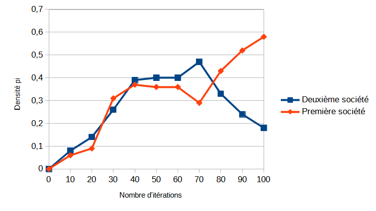
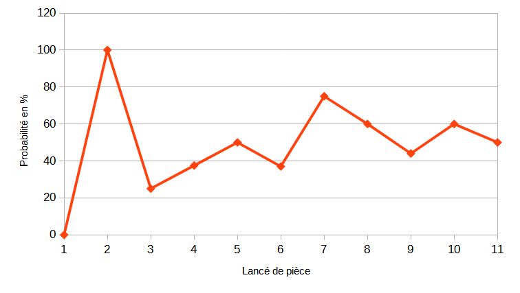

# Life2

*Étude sur l’évolution du comportement d’individus au sein de sociétés
similaires partageant un territoire commun.*

L’étude Life2 est un jeu de simulation générique inspiré du célèbre
[Jeu de la Vie de Conway][gol] dans lequel nous modélisons deux sociétés aux
propriétés similaires dans l’objectif d’analyser leurs évolutions et
interactions au cours du temps.

[gol]: https://conwaylife.com/wiki/Conway%27s_Game_of_Life

## Règles du jeu

Bien que Life2 et sa principale implémentation soient flexibles sur les
fonctions d calcul utilisées pour continuer la simulation, nous avons
décider de rester proche des règles fondamentales de la version de Conway,
dans l’objectif de minimiser les différences logiques entre l’étude proposée
et le sujet du Jeu de la Vie.

Ainsi nous disposons de trois règles :

  1. **Règle de recrutement :** si une cellule vide à trois voisins de la même
     équipe, et que le nombre de voisins de la seconde équipe est différent de
     trois, alors la cellule devient membre de la première équipe.
  2. **Règle de propagande :** si une cellule vide a le même nombre de voisins
     dans chaque équipe, alors elle rejoint une des deux équipes de manière
     totalement aléatoire.
  3. **Règle du prisonnier :** si le nombre de voisins de l’équipe adverse est
     supérieur à celui de l’équipe de la cellule, alors la cellule change
     d’équipe.

Nous définissons $R$ comme l’ensemble contenant les règles.

Nous pouvons aussi remarquer que le grille du jeu ne pourra que se remplir.
En effet, le choix de ne pas ajouter une règle de surpopulation à $R$ est
expliqué par la volonté de simplifier la simulation effectuée.

## Simulation et évaluation

Maintenant que les règles du jeu sont expliquées et que le fonctionnement du
jeu en découle, nous pouvons lancer une simulation.
L’évolution du jeu est effectuée à l’aide d’une [implémentation open-source
du jeu disponible en ligne][gh] créée par Nicolas.

[gh]: https://github.com/nc0fr/life2

La simulation se place dans un plan 2D carré, de côté $100$ cellules.
Le paterne initial et sa densité sont choisis aléatoirement à l’aide d’un
algorithme de bruit simplex (non-traité ici).

À chaque itération $i$ de la simulation, nous notons $p_i$ la densité de
population d’une société.
Cette valeur est déterminée à partir d’équations de la théorie du champ
moléculaire de Pierre Weiss en physique.

Grâce à ces données, nous pouvons visualiser l’évolution des sociétés par un
graphe.

<!-- TODO(nc0): Graphique -->

Nous pouvons remarquer une explosion de la densité dans les deux sociétés de
l’itération $i=0$ à $i=40$. Ensuite, nous pouvons constater une courte
stabilisation (de $i=41$ à $i=60$), avant d’observer une chute brutale pour
la seconde société et une nette augmentation pour la première.

Il est important de rappeler que la graphe présentée proviens d’une seule
simulation, et que chaque lancer d'un monde peut amener à des résultats
différents.

## Interprétation

Pour commencer notre interprétation de nos résultats, nous commençons par
diviser notre graphe en trois périodes telles que décrites ici :

  1. première période, $\forall i \in [0; 40]$ ;
  2. deuxième période, $\forall i \in ]40; 60]$ ; et
  3. troisième période, $\forall i \in ]60; 100]$.

La première période, que nous pouvons nommer *Période d’expansion*, est
marquée par une explosion presque qu'exponentielle de la densité de population
dans chacune des sociétés.
Nous pouvons expliquer ce comportement par le fait que les cellules “recrutent”
parmi les cellules vides, tel un liquide remplissant un contenant vide.

La deuxième période, intitulée *Période de stabilisation*, permet
l’observation d’un fort ralentissement de la croissance des densités.
Nous pouvons théoriser que la majorité des cellules vides ont déjà été
recrutées par les sociétés.
De plus, nous pensons que l’effet de stabilisation des sociétés durant cette
période est influencé par la **Règle de propagande** (deuxième règle de $R$).
En effet, un choix aléatoire parmi deux possibilités modélise une probabilité
$\pi = 1/2$, qui a tendance à se "stabiliser" après un grand nombre d'itération
(c.f. la loi des grands nombres).

Une autre preuve empirique de ce phénomène est démontrée par le changement
distinct de croissance de la courbe durant la stabilisation, lorsque nous
modifions la deuxièmes règle.
Nous pouvons alors établir une relation forte (appelée élasticité) entre la
probabilité de la **Règle de propagande** et la croissance évolutive de la
densité de population :

- Étant dans un modèle fermé, la formule de l'élasticité est
$$
\epsilon(\mathbb{A}, \mathbb{B}) =
\frac{\frac{\mathbb{A}_2 - \mathbb{A}_1}{\mathbb{A}_1}}{\frac{\mathbb{B}_2 - \mathbb{B}_1}{\mathbb{B}_1}}
$$

- Nous avons $\mathbb{A} = \pi$  (la probabilité qu'une cellule aille dans une
  des deux sociétés pendant la **Règle de propagande**) et $\mathbb{B} = p_i$
  (la densité de population lors à la fin de la *Période de stabilisation*.

- Nous comparons notre simulation actuelle à une simulation où la
  pièce est truqué pour favoriser la première société de manière significative :
  $(\pi_1 = \frac{1}{2}, {p_i}_1 = 0.36)$ ; $(\pi_2 = \frac{6}{7}, {p_i}_1 = 0.37)$

- Alors
$$
\epsilon =
\frac{\frac{\frac{6}{7} - \frac{1}{2}}{\frac{1}{2}}}{\frac{0.37 - 0.36}{0.36}} \approx
24
$$.

- $24 > 1 \implies$ le niveau de stabilistion dépend très fortement de la
  probabibilité de la **Règle de propagande**.

Dernièrement, la troisième période, surnommée *Période de guerre*, illustre
une tendance chaotique puis désastreuse de l’évolution de la densité.
En effet, nous pouvons observer une augmentation de la densité de la
population de notre première société, tout en observant une diminution
proportionnelle de la densité de population de notre seconde société.
Le coefficient de proportionnalité est de $\frac{{p_i}_{bleue}}{{p_i}_{rouge}}$.

Nous pouvons expliquer l’apparition de cette période par le fait que
l’intégralité des cellules du jeu sont remplies, et qu’il ne reste que la
troisième règle de $R$ à appliquer (les deux autres nécessitant des cellules
vides).

Dû aux importants coûts de calcul, nous ne pouvons pas aller au delà de $100$
itérations sans risque de corruption (bogue logiciel), ce qui ne nous permet
pas d’affirmer un certain déterminisme dans l’évolution des croissances durant
cette dernière période. Cependant, nous pouvons justifier l’existence du
rapport de proportionnalité entre les évolutions des courbes : les pertes
rouges sont les nouveaux prisonniers bleus.

## Conclusion, discussions et ouverture

Nous avons obtenu des résultats intéressants dans la partie précédente, que
nous avons pu expliquer à l’aide de théories simples utilisant divers outils
mathématiques.

Cela permet de démontrer l’utilité des mathématiques dans la modélisation et
analyse de simulations simplistes. Ainsi nous pouvons aussi comprendre
l’intérêt que suscite le Jeu de la Vie de Conway et ses variantes auprès de la
communauté scientifique : comment un jeu aux règles simples tel que Life2 ou le
Jeu de la Vie permet-il te modéliser des situations plus complexes de manière
fiable.

Aussi nous pouvons terminer l’étude en rapprochant l’évolution spontanée puis
destruction chaotique de notre seconde société avec le résultat de certains
conflits géo-politiques contemporains.

## Références

- *L’hypothèse du champ moléculaire et la propriété ferromagnétique*,
  Pierre Weiss, la théorie des champs moléculaires.

- *Heinsenberg and ferromagnetism*, S. Chatterjee, une explication de
  application de la théorie des champs moléculaires.

